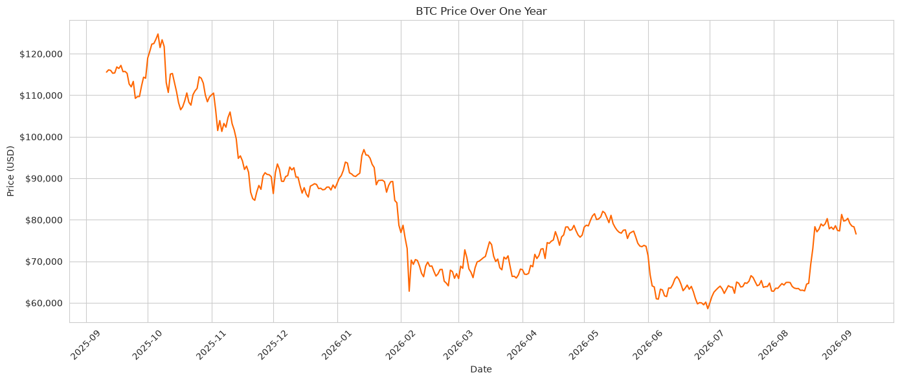
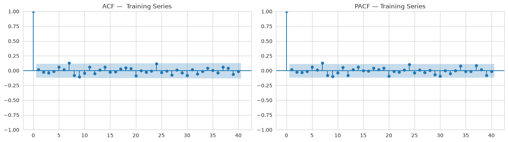
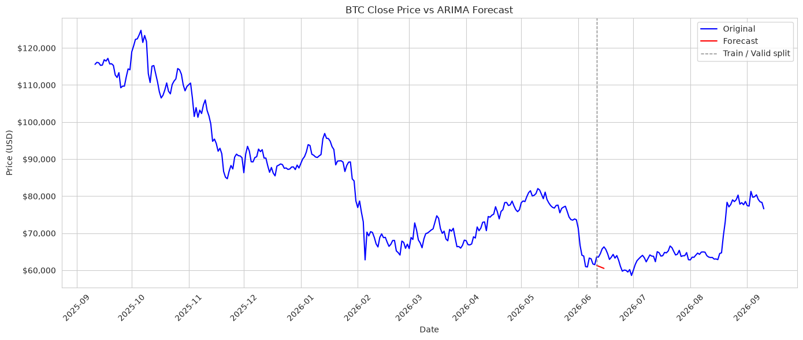
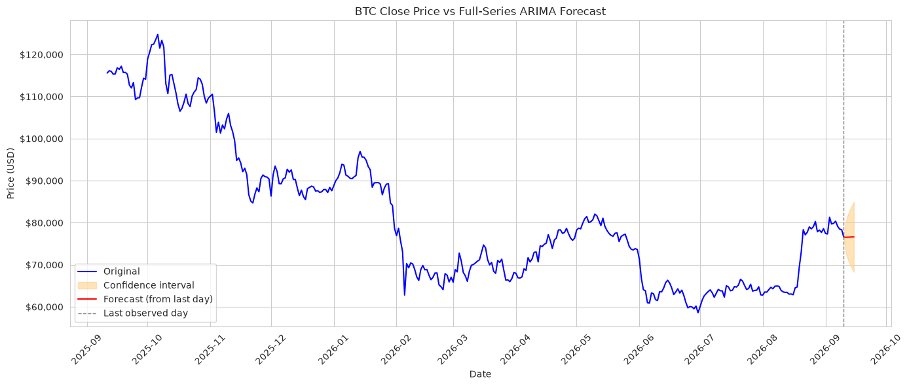

# Bitcoin Time Series Forecasting Model

Short-horizon Bitcoin (BTC) price forecasting with a classical ARIMA model. The repository includes the exploratory analysis, training and validation notebook, a joblib-serialized production estimator, and a small loader you can run after training.

This project is for research and education. It is **not** investment advice. Developers are not liable for any investment decisions made with this model.

## Table of Contents

- [What This Project Is](#what-this-project-is)
- [Data](#data)
- [Model Selection](#model-selection)
- [Training and Validation Findings](#training-and-validation-findings)
- [Visuals](#visuals)
- [Environment Setup](#environment-setup)
- [Usage](#usage)
- [Repository Layout](#repository-layout)
- [Contributing](#contributing)
- [License](#license)
- [Contact](#contact)

## What This Project Is

A reproducible pipeline for forecasting daily BTC close prices in USD:

1. Load and clean a daily historical price series.
2. Explore trend, noise, and serial correlation.
3. Fit a low-order ARIMA model on a chronological train split.
4. Backtest a 5-day forecast against a held-out validation window.
5. Retrain on the full modeling window and serialize the estimator with [joblib](https://joblib.readthedocs.io/).

The intended use is **1–5 day** ahead forecasts. Confidence intervals widen quickly after that, so longer horizons are not treated as decision-grade.

## Data

| Item | Value |
| --- | --- |
| Asset | Bitcoin (BTC) close price in USD |
| Granularity | Daily |
| File | `data/btc-time-series-data.csv` |
| Columns | `event_date`, `close_price_usd`, `market_cap_usd`, `volume_usd` |
| Full history | 4,885 daily rows, 2013-04-28 through 2026-09-10 |
| Modeling window | Last 365 days (`2025-09-11` → `2026-09-10`) |

Market cap and volume are dropped before modeling. The series has one missing close price; that gap is filled with time interpolation after the daily frequency is set. Training uses only `close_price_usd`.

Daily data was chosen over minute, hourly, weekly, monthly, and yearly series so the starter model could target short-term forecasts without the noise of intra-day ticks or the sparsity of coarser calendars.

## Model Selection

Candidate families considered after exploration were **ARIMA**, **SARIMA**, and **exponential smoothing**.

Exploration of the last year of daily closes showed:

- A strong downward drift from about $115k toward the $60k–$80k range, with sharp local jumps.
- No stable seasonal cycle that would justify SARIMA seasonal terms.
- Erratic day-to-day moves, so a simple level-plus-short-memory specification was preferred over a seasonal or heavily parameterized model.

Order selection used ACF and PACF on the **first-differenced** training series. Almost all lags after zero sit inside the confidence bands, which points to a low-order process. The selected specification is:

```text
ARIMA(1, 0, 1) on first differences of daily close
```

that is, one autoregressive term and one moving-average term on the differenced price. Differencing (`d = 1` on the raw price, applied before the `(1, 0, 1)` fit) removes the non-stationary trend visible in the raw series.

## Training and Validation Findings

The last year of daily closes is split **chronologically 75 / 25** (no shuffle):

| Split | Days | Dates |
| --- | --- | --- |
| Full modeling series | 365 | 2025-09-11 → 2026-09-10 |
| Train | 273 | 2025-09-11 → 2026-06-10 |
| Validation | 92 | 2026-06-11 → 2026-09-10 |

**Fit on the training window (`ARIMA(1, 0, 1)`):**

| Statistic | Value |
| --- | --- |
| Observations | 272 differenced days |
| Log-likelihood | -2452.71 |
| AIC | 4913.41 |
| BIC | 4927.83 |
| Ljung–Box Q (lag 1) | 0.06 (p = 0.80) |

The Ljung–Box p-value indicates residual autocorrelation at lag 1 is not significant. Individual AR and MA coefficients are weak on their own; they are kept as the ACF/PACF-selected low-order pair, not as a claim of a strong identifiable ARMA structure.

**5-day backtest on the start of the validation window:**

| Metric | Value |
| --- | --- |
| MAE | $3,818.07 |
| RMSE | $4,065.52 |
| MAPE | 5.87% |

Forecasted validation opens (USD): 61,280 → 61,081 → 60,881 → 60,683 → 60,484.

**Practical horizon**

| Horizon | Usability |
| --- | --- |
| 1–5 days | Most useful; tightest interval |
| 5–14 days | Usable, but the interval widens quickly |
| 15–30 days | Marginal; the path drifts toward a mean plus a slight trend |
| 30+ days | Not useful for this linear specification |

After validation, the same `(p, d, q)` is refit on the full 365-day window. A 5-day production forecast from 2026-09-10 has these 95% intervals (USD):

| Date | Lower | Upper |
| --- | --- | --- |
| 2026-09-11 | 72,872 | 80,136 |
| 2026-09-12 | 71,293 | 81,763 |
| 2026-09-13 | 70,110 | 82,993 |
| 2026-09-14 | 69,129 | 84,021 |
| 2026-09-15 | 68,276 | 84,921 |

The fitted full-series model is serialized to `prod_model/arima_btc.joblib`.

## Visuals

### Exploration — last year of daily closes

The raw series is trending and locally noisy, with large level shifts rather than a repeating seasonal pattern.



### Training — ACF and PACF of the differenced training series

Lag-0 dominates. Remaining spikes stay near the bands, which supports a low-order ARIMA instead of a long AR/MA or seasonal specification.



### Validation — 5-day forecast vs held-out prices

The red segment is the short validation forecast just after the train/valid split. The model is evaluated on that short horizon, not on the full 92-day tail.



### Production — full-series 5-day forecast

The model is refit on the entire modeling window. The shaded band is the 5-day confidence interval from the last observed day.



## Environment Setup

Requirements: **Python 3.12+**. Dependencies are declared in `pyproject.toml` (`pandas`, `numpy`, `matplotlib`, `seaborn`, `statsmodels`, `scikit-learn`, `jupyterlab`, `joblib`).

### 1. Clone the repository

```bash
git clone git@github.com:FantasyFalx/btc-time-series-forecasting-model.git
cd btc-time-series-forecasting-model
```

### 2. Create a virtual environment and install the project

With [uv](https://docs.astral.sh/uv/):

```bash
uv sync
```

Or with pip:

```bash
python3.12 -m venv .venv
source .venv/bin/activate
pip install -e .
```

### 3. Provide the daily price CSV

Place the historical file at:

```text
data/btc-time-series-data.csv
```

It must include `event_date` and `close_price_usd`. `market_cap_usd` and `volume_usd` may be present; the notebook drops them.

### 4. Train and serialize

```bash
jupyter lab pipeline/model_training.ipynb
```

Run all cells. The notebook cleans the series, plots exploration and ACF/PACF charts, fits ARIMA, scores the 5-day backtest, refits on the full window, and writes `prod_model/arima_btc.joblib`.

## Usage

Load the serialized model after the notebook has been run:

```bash
python src/main.py
```

That script prints the estimator type and ARIMA order. In your own code:

```python
from pathlib import Path
import joblib

model = joblib.load(Path("prod_model") / "arima_btc.joblib")
forecast = model.get_forecast(steps=5)
print(forecast.predicted_mean)
print(forecast.conf_int())
```

Keep forecasts in the 1–5 day range described above.

## Repository Layout

```text
src/main.py                    Load the serialized ARIMA model
pipeline/model_training.ipynb  Cleaning, visuals, training, validation, serialization
docs/                          Planning notes and README figures
docs/figures/                  Exploration, ACF/PACF, validation, and forecast plots
pyproject.toml                 Project metadata and dependencies
data/btc-time-series-data.csv  Daily BTC series used for training
prod_model/arima_btc.joblib    Serialized full-series ARIMA estimator
```

## Contributing

1. Fork the repository.
2. Clone your fork and create a feature branch.
3. Keep changes focused and follow existing style (`black` on Python files).
4. Re-run `pipeline/model_training.ipynb` if you change cleaning, order selection, or validation.
5. Open a pull request that explains the change and how you checked it.

## License

MIT License

Copyright (c) 2026 George Stimson

Permission is hereby granted, free of charge, to any person obtaining a copy
of this software and associated documentation files (the "Software"), to deal
in the Software without restriction, including without limitation the rights
to use, copy, modify, merge, publish, distribute, sublicense, and/or sell
copies of the Software, and to permit persons to whom the Software is
furnished to do so, subject to the following conditions:

The above copyright notice and this permission notice shall be included in all
copies or substantial portions of the Software.

THE SOFTWARE IS PROVIDED "AS IS", WITHOUT WARRANTY OF ANY KIND, EXPRESS OR
IMPLIED, INCLUDING BUT NOT LIMITED TO THE WARRANTIES OF MERCHANTABILITY,
FITNESS FOR A PARTICULAR PURPOSE AND NONINFRINGEMENT. IN NO EVENT SHALL THE
AUTHORS OR COPYRIGHT HOLDERS BE LIABLE FOR ANY CLAIM, DAMAGES OR OTHER
LIABILITY, WHETHER IN AN ACTION OF CONTRACT, TORT OR OTHERWISE, ARISING FROM,
OUT OF OR IN CONNECTION WITH THE SOFTWARE OR THE USE OR OTHER DEALINGS IN THE
SOFTWARE.

## Contact

- **Name:** George Stimson
- **Email:** [cstim.murdoch@gmail.com](mailto:cstim.murdoch@gmail.com)
- **LinkedIn:** [george-stimson-248446252](https://www.linkedin.com/in/george-stimson-248446252)
